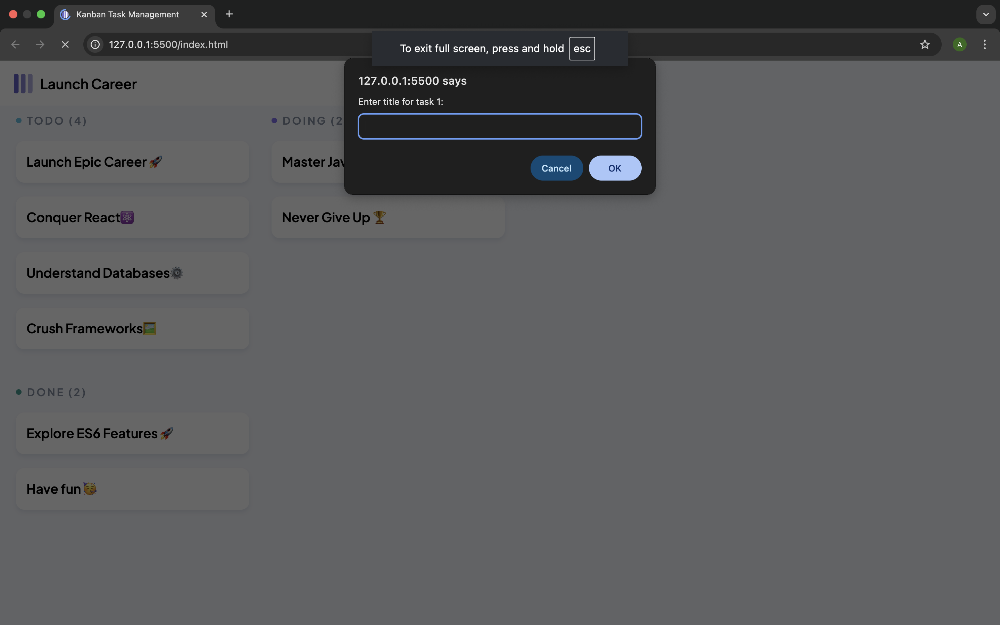
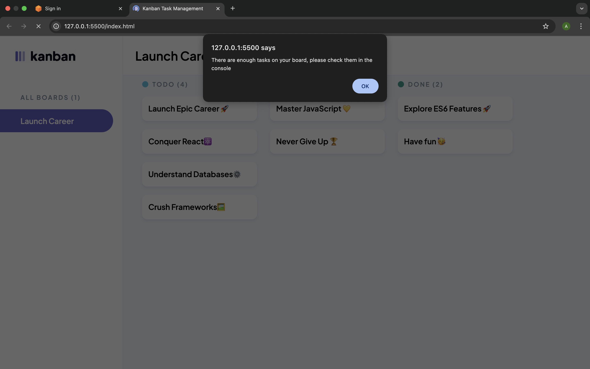

# 📝 Kanban Task Board

A simple task management system built using HTML, CSS, and JavaScript. This system allows users to add tasks dynamically by entering task details through prompts. Tasks are organized into three columns: **TODO**, **DOING**, and **DONE**.while enforcing a task limit.

## 🚀 Features

- Users are prompted to enter:
  - Task Title
  - Task Description
  - Task Status (`todo`, `doing`, or `done`)
- Status input is case-insensitive and validated.
- Task limit enforced with an alert:
 " There are enough tasks on your board, please check them in the console"
- Display tasks in the console:

  - All tasks as an array

  - Completed tasks only or if no tasks are marked as `done`, a motivational message is logged:  
  _"No tasks completed, let's get to work!"_  

## 📁 Folder Structure

project-root/
├── index.html # Main HTML file
├── styles.css # Styling for the board
├── script.js # JavaScript logic for prompts
└── assets/ # Logos, icons, and favicons
└── README.md # Project documentation
└── images/  # Screenshots

## ✅ Valid Status Options

When prompted, you can only enter:
- `todo`
- `doing`
- `done`

These can be typed in **any case** (e.g., `TODO`, `Done`, `Doing`).

## 🧪 How to Run

1. Clone or download the repo.
2. Open `index.html` in a browser.
3. The JavaScript will prompt you to add tasks until the board reaches its task limit.
4. Open Developer Tools → Console to see:
- All tasks
- Completed tasks or a motivational message

## 📸 Screenshots
 ###### Example of a prompt

###### Example of a limit alert

###### Example of tasks dispalyed in the console

## 🧑‍💻 Author

Created by _Ayabonga Mtsotso._

---
